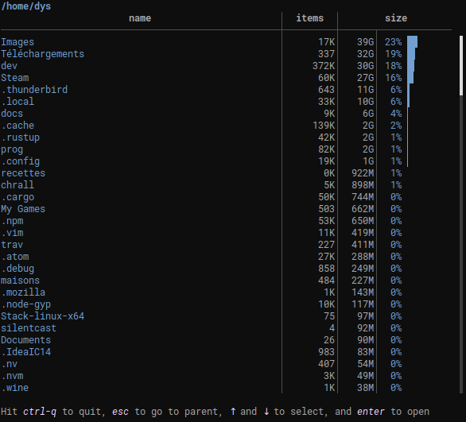

[![MIT][s2]][l2] [![Latest Version][s1]][l1] [![Chat on Miaou][s3]][l3]

[s1]: https://img.shields.io/crates/v/whalespotter.svg
[l1]: https://crates.io/crates/whalespotter

[s2]: https://img.shields.io/badge/license-MIT-blue.svg
[l2]: LICENSE

[s3]: https://miaou.dystroy.org/static/shields/room.svg
[l3]: https://miaou.dystroy.org/3?broot

a convenient application to fast locate fat files and folders (linux & mac)

## Installation

The simplest solution is to execute

	cargo install whalespotter

## Usage

Pass the desired path:

	whalespotter ~

* Hit *ctrl-q* to quit
* *↑* and *↓* to select and *enter* to open",
* *enter* to open the selected directory (in whalespotter) or file (with `xdg-open`)
* *esc* to either unselect, or go to parent, or quit
* *pageUp* and *pageDown* to scroll
* *F5* to refresh

Note: reported sizes take blocks into account, so they may be smaller than the nominal size for sparse files (the goal is to find what takes space in your disks).

Whalespotter is dedicated to one use case: spotting big directories and files. If you want also other features like launching, deleting, moving, etc. you may be interested in a less focused tool, [broot](https://github.com/Canop/broot).
